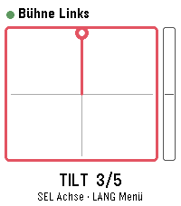
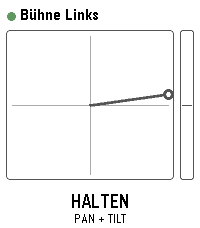
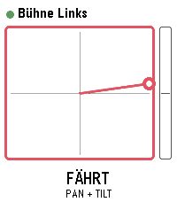
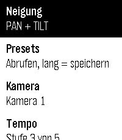

# PTZ Remote — Panasonic-Kameras von der Pebble Time 2 steuern

Eine Watchapp für die **Pebble Time 2** (Plattform `emery`), mit der sich
Panasonic-PTZ-Kameras der AW-Serie direkt vom Handgelenk aus fahren lassen —
über die Tasten oder über die Neigung der Uhr.

| Tasten | Neigung, bereit | Neigung, Kamera fährt | Menü |
|---|---|---|---|
|  |  |  |  |

## Wie es zusammenhängt

```
   Pebble Time 2                Telefon (Pebble-App)            Kamera
   ┌────────────┐   Bluetooth   ┌──────────────────┐    WLAN    ┌─────────┐
   │  Watchapp  │ ────────────▶ │   PebbleKit JS   │ ─────────▶ │ AW-...  │
   │   (C)      │ ◀──────────── │  HTTP-CGI-Aufruf │ ◀───────── │         │
   └────────────┘    Status     └──────────────────┘   Antwort  └─────────┘
```

Die Uhr hat kein eigenes Netz. Sie schickt deshalb den **gewünschten Zustand
aller Achsen** ans Telefon, und das Telefon setzt ihn in Panasonic-CGI-Aufrufe um:

```
http://<kamera>/cgi-bin/aw_ptz?cmd=%23PTS7030&res=1
```

Dass immer der ganze Zustand übertragen wird und nicht einzelne Tastendrücke,
ist Absicht: Geht ein Paket verloren, korrigiert das nächste die Lage wieder.
Bei einer Fernsteuerung, bei der ein verschlucktes „Stopp" eine Kamera gegen
den Anschlag fahren lässt, ist das die sichere Variante.

## Bedienung

### Tastenansicht (Start)

| Taste | Wirkung |
|---|---|
| **Auf / Ab** halten | gewählte Achse fahren, Loslassen hält an |
| **Select** kurz | Achse wechseln: TILT → PAN → ZOOM → FOCUS |
| **Select** lang | Menü |
| **Back** | App verlassen (hält die Kamera an) |

### Neigungssteuerung

Erreichbar über **Menü → Neigung**.

| Taste | Wirkung |
|---|---|
| **Select** halten | Totmannschalter: nur währenddessen fährt die Kamera |
| **Auf / Ab** halten | Zoom Tele / Weitwinkel |
| **Back** kurz | zurück |
| **Back** lang | Achsen umschalten: Pan+Tilt → Pan+Zoom → nur Tilt |

Der **Nullpunkt ist die Haltung im Moment des Drückens**, nicht eine feste
Achse im Raum. Die Kamera lässt sich also aus jeder bequemen Armhaltung heraus
fahren — auch mit angewinkeltem Arm im Dunkeln neben dem Pult.

Solange der Schalter nicht gedrückt ist, zeigt die Anzeige die Neigung
trotzdem an. Damit lässt sich vor der ersten Fahrt prüfen, ob die Richtungen
stimmen; falls nicht, in den Einstellungen **Pan** oder **Tilt umkehren**.

> **Warum Lagesensor statt Drehratensensor?**
> Das Pebble-SDK gibt keinen Gyroskop-Zugriff frei, und für diesen Zweck ist
> der Lagesensor ohnehin das bessere Signal: Er misst die *Haltung* gegen die
> Schwerkraft. Wer die Hand still hält, hält damit auch die Kamera still.
> Eine reine Drehratenmessung würde mit der Zeit wegdriften und die Kamera
> langsam davonlaufen lassen.

## Damit nichts unbeaufsichtigt weiterfährt

Im Vorstellungsbetrieb ist eine Kamera, die von allein weiterschwenkt, der
schlimmste Fall. Dagegen stehen vier Vorkehrungen:

1. **Totmannschalter** — die Neigungssteuerung fährt nur bei gedrückter Taste.
2. **Anlaufsperre** — ein kurzer Tipp löst keine Fahrt aus (250 ms Verzögerung).
3. **Wachhund auf dem Telefon** — meldet sich die Uhr während einer Fahrt
   1,6 Sekunden lang nicht (außer Reichweite, leerer Akku, beendete App),
   hält das Telefon die Kamera von sich aus an.
4. **Stopp beim Beenden** — App schließen, Kamera wechseln und jeder
   Ansichtswechsel schicken zuerst ein Stopp hinaus.

## Einrichten

### 1. An der Kamera

- Die Kamera muss im selben Netz erreichbar sein wie das **Telefon**.
- Die CGI-Schnittstelle muss freigeschaltet sein (bei Panasonic je nach Modell
  unter *Netzwerk → Benutzerauth* bzw. *Hostauth*).
- **Zur Anmeldung:** Die App kann Basic-Auth. Verlangt die Kamera
  Digest-Auth — das tun neuere Modelle wie die AW-UE-Reihe —, funktioniert die
  Anmeldung über die Konfigurationsseite nicht. Dann in der Kamera entweder
  die Benutzerauthentifizierung für CGI abschalten oder eine Host-Freigabe für
  das Telefon eintragen.

### 2. In der Pebble-App auf dem Telefon

Unter **Einstellungen** der Watchapp:

- **Kamera 1–8**: Name, IP-Adresse, Port, optional Benutzer und Passwort.
  Leere Blöcke tauchen auf der Uhr nicht auf.
- **Tempo** (1–5): wie viel von der Maximalgeschwindigkeit ausgereizt wird.
  Für Fahrten im laufenden Betrieb sind 1 bis 2 meist genug.
- **Empfindlichkeit** (1–10): 1 verlangt rund 40° Neigung für Vollausschlag,
  10 schon rund 12°.
- **Totzone** (20–200): wie ruhig die Hand sein darf, bevor etwas passiert.
- **Preset-Zählung**: Panasonic zählt intern ab 0, Preset 1 auf der Uhr ist
  also normalerweise Kamera-Speicher 0. Falls die Kamera anders zählt,
  hier umstellen.

Die Kameradaten bleiben auf dem Telefon; auf die Uhr wandern nur die
Bedienwerte.

## Bauen

```bash
pip install pebble-tool
pebble sdk install latest

cd pebble-ptz-remote
npm install              # holt pebble-clay für die Konfigurationsseite
pebble build
pebble install --phone <IP-des-Telefons>
```

Gebaut wird für `emery` (Pebble Time 2) sowie `basalt`, `chalk` und `diorite`.
Das Layout richtet sich nach der tatsächlichen Bildschirmgröße, läuft also
auch auf den runden und den schwarzweißen Modellen.

## Tests

Beide Tests laufen ohne Uhr und ohne Kamera:

```bash
node test/panasonic.test.js   # CGI-Befehle, Grenzwerte, Fehlerfälle
node test/bridge.test.js      # ganze Telefon-Seite gegen eine nachgebaute Kamera
```

`bridge.test.js` startet einen echten HTTP-Server, der wie eine Panasonic-Kamera
antwortet, und prüft unter anderem, ob der Wachhund die Kamera wirklich anhält.

## Aufbau des Quelltextes

```
src/c/
  main.c        Start, Ende und das Stopp beim Beenden
  comm.c        AppMessage-Schicht: Sollzustand, Warteschlange, Wiederholungen
  motion.c      Lagesensor → Kamerageschwindigkeit (Festkomma, ohne libm)
  settings.c    Einstellungen, lokal gespeichert
  gauge.c       gemeinsame Anzeige für beide Steuerarten
  win_remote.c  Tastenansicht
  win_gyro.c    Neigungssteuerung mit Totmannschalter
  win_menu.c    Menü, Presets, Kamerawahl
src/pkjs/
  index.js      Brücke zwischen Uhr und Kamera, Wachhund
  panasonic.js  CGI-Schicht mit Warteschlange und Fehlerauswertung
  config.js     Konfigurationsseite (Clay)
```

## Getestete Kameras

Die App spricht das dokumentierte AW-Protokoll und sollte mit der gesamten
AW-Serie funktionieren (AW-HE38/40/42/130, AW-UE4/20/40/50/80/100/150, AW-UR100).
Auf echter Hardware geprüft ist bisher nichts — die Protokollschicht ist gegen
eine nachgebaute Kamera getestet, die Bedienung im Pebble-Emulator.
Rückmeldung aus dem echten Betrieb ist willkommen.
