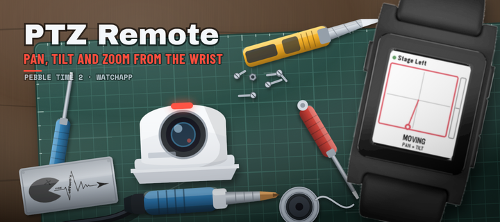

# Store-Banner: die Werkbank-Serie

Ein Banner (720 x 320) fuer den Pebble Appstore, das fuer alle SIDE
effect's Apps gleich aufgebaut ist: Draufsicht auf den Basteltisch, auf
dem gerade genau diese App entsteht.



## Was die Serie zusammenhaelt

Diese Teile liegen in jedem Banner an derselben Stelle - daran erkennt man
die Serie, bevor man den Titel gelesen hat:

| Element | Platz |
|---|---|
| Holzplatte mit Schneidematte | ganze Flaeche, Matte leicht schraeg |
| Titel, Unterzeile, Plattformzeile | oben links, auf dem freien Holz |
| Pebble mit dem Screenshot im Display | rechts, gekippt, Armbaender laufen aus dem Bild |
| Teppichmesser | oben, zwischen Titel und Uhr |
| Zwei Feinschraubendreher | links senkrecht und rechts neben dem Geraet |
| Loetkolben mit Kabel | unten, Kabel laeuft nach links aus dem Bild |
| Loetzinn, Schrauben | Streu-Kram, fuellt die Luecken |
| SIDE effect's Logo | unten links, in wechselnder Form |

## Was sich je App aendert

- **Das Projekt in der Bildmitte** - das Geraet, um das es geht.
- **Die Akzentfarbe** - Unterzeile, Leuchtpunkte, Strich unter dem Titel.
- **Die Form des Logos** - Aufkleber, Alu-Plakette, Notizzettel,
  Tintenstempel oder Siebdruck auf der Matte. Immer da, nie zweimal
  gleich.
- **Die Lage der Werkzeuge** - `--seed` verschiebt und verdreht sie in
  engen Grenzen. Gleicher Seed heisst gleiches Bild, das Banner ist also
  jederzeit reproduzierbar.

## Bauen

```bash
python3 make_desk_banner.py \
    --projekt ptz \
    --shot ../release/screenshots_emery/1_motion.png \
    --titel "PTZ Remote" \
    --unterzeile "PAN, TILT AND ZOOM FROM THE WRIST" \
    --seed 11 \
    --out banner_720x320.png
```

Wichtige Schalter:

| Schalter | Wirkung |
|---|---|
| `--projekt` | `theremin`, `ptz`, `helo` - das Geraet in der Mitte |
| `--shot` | Screenshot fuer das Display, in nativer Aufloesung |
| `--seed` | Anordnung der Werkzeuge; einfach durchprobieren |
| `--logo-art` | `auto` (Voreinstellung) oder `sticker`, `plakette`, `kritzel`, `stempel`, `druck` |
| `--akzent` | Akzentfarbe ueberschreiben, z. B. `"#ff8a1e"` |
| `--uhr` | `pebble_time_2` (Voreinstellung) oder `pebble_time_steel` |
| `--plattform` | die kleine Zeile unter dem Titel |

Fertiges Banner vor dem Release an seinen Platz kopieren:

```bash
cp banner_720x320.png ../release/banner_720x320.png
```

## Ein neues Projekt aufnehmen

1. In `scene.py` eine Funktion `projekt_<name>(akzent)` schreiben, die das
   Geraet um den Nullpunkt herum zeichnet (etwa 260 x 180 Bannereinheiten,
   Akzentfarbe fuer Leuchtpunkte und Anzeigen).
2. Den Namen in `PROJEKTE` am Ende von `scene.py` eintragen.
3. In `make_desk_banner.py` eine Akzentfarbe in `AKZENTE` und eine
   Logo-Form in `LOGO_JE_PROJEKT` hinterlegen - eine, die noch keine
   andere App hat.

## Voraussetzungen

- Python 3 mit Pillow (`pip install pillow`)
- Chromium, Chrome oder Edge. Wird automatisch gesucht; sonst den Pfad in
  `BANNER_CHROME` setzen.

## Dateien

```
make_desk_banner.py   Zusammenbau, Titel, Logo-Formen, Kommandozeile
scene.py              Tisch, Matte, Werkzeuge, Kleinkram, Projektgeraete
render.py             SVG -> PNG ueber den Browser, 2-fach ueberabgetastet
assets/               freigestellte Uhraufnahmen, uhren.json, Logo
fonts/                eingebettete Schriften (siehe SCHRIFTEN.md)
```
